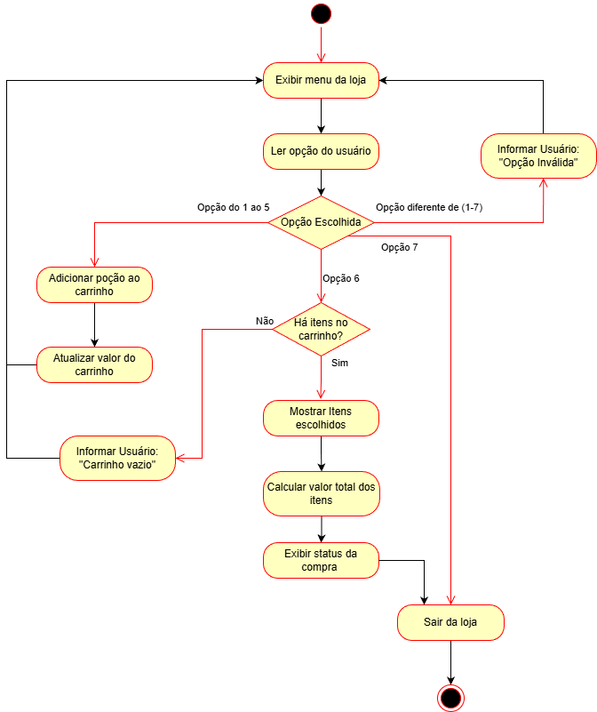
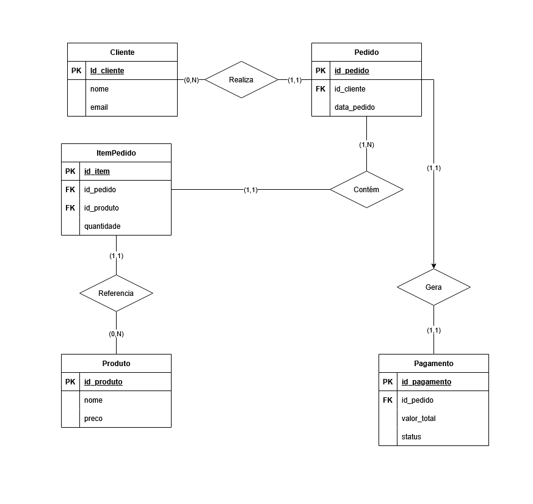

# Loja-de-Pocoes---Arquitetura-de-Software

## Descrição do Projeto

Projeto de simulação de uma lojinha online, desenvolvido em Java com arquitetura monolítica cliente-servidor.  
O sistema permite que o cliente navegue pelos produtos, adicione itens ao carrinho, finalize a compra e processe o pagamento por meio de um serviço externo simulado.

---

## Diagrama de Atividades UML

A seguir, um diagrama demonstrando o fluxo lógico de atividades do projeto, uma loja de poções mágicas:

---

## Diagrama Entidade-Relacionamento (DER)

Abaixo está o modelo lógico de dados utilizado para estruturar as entidades do sistema, destacando chaves primárias (PK), chaves estrangeiras (FK) e as cardinalidades.

---

## ⚙️ Funcionalidades
- Listagem de produtos disponíveis.  
- Adição de itens ao carrinho.  
- Cálculo do valor total do pedido.  
- Processamento de pagamento com retorno de status (APROVADO ou NEGADO).  

---

## 🧩 Padrão Singleton
- **Classe:** `ServicoPagamento`  
- **Implementação:**  
  - Construtor privado.  
  - Método estático `getInstance()` que garante apenas uma instância durante toda a execução.  
- **Justificativa:**  
  - Centraliza a comunicação com o sistema de pagamento.  
  - Evita múltiplas instâncias competindo por recursos.  
  - Garante consistência e controle único sobre as transações.  

---
##▶️ Execução
🔹 No VS Code
Abra o projeto no VS Code.

Certifique-se de ter a extensão Java Extension Pack instalada.

Clique com o botão direito em Loja.java → Run Java.

O programa será executado no terminal integrado do VS Code.

🔹 No IntelliJ IDEA
Abra o projeto no IntelliJ IDEA.

O IntelliJ reconhecerá automaticamente o pom.xml como projeto Maven.

Vá até a classe Loja.java.

Clique no botão Run (seta verde) ao lado do método main.

O programa será executado no console do IntelliJ.

